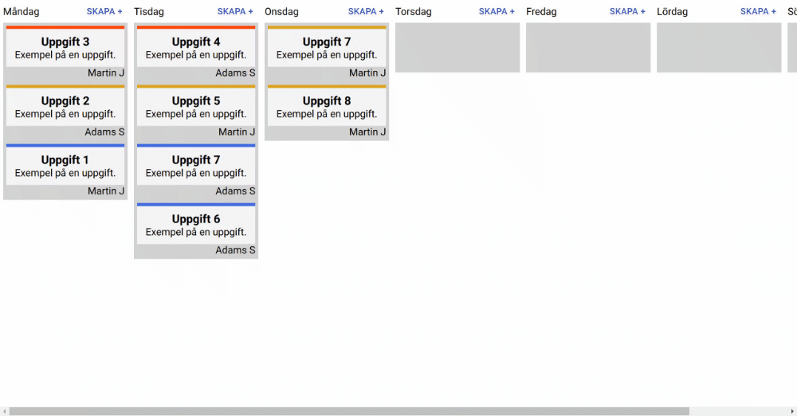

  Hi 👋, I'm Martin Jonsson.  
  A full stack developer from Sweden.

Down below are som of my public projects, more are added over time.

You can reach me at
<a href="mailto:mailtojonsson@gmail.com" target="_blank"> LinkedIn </a> or by <a href="https://www.linkedin.com/in/martin-jonsson-a896461a3/" target="_blank"> email</a>.

My <a href="https://drive.google.com/file/d/1ua7-e9ZdjRKdYUvICJpR7Ci5Dh9IeGjs/view?usp=sharing" target="blank">Resume</a> and <a href="https://drive.google.com/drive/u/0/folders/1qwY_27pUvTSvHhH0OBf7pKr1jKkiP4Ru" target="_blank">Cover Letter</a> **in swedish**

## Skills

  

  
  
  
  
  
  
  
  
  

# Projects

## Åre CMS

## Planner

A weekly drag and drop planner built for a client.
 
Data hosted with <a href="supabase.io" target="_blank">Supabase</a>
 
Published with Github pages.
 
<a href="https://arnell0.github.io/planner" target="_blank">Live Demo</a>
  

  

<!-- 

 -->

## Weather

A simple page for viewing the weather.
 
Data from freemium API <s>theRainery.com</s> **No longer active**
 
Icons from <a href="feathericons.com" target="_blank">Feather</a>
 
Data hosted with <a href="supabase.io" target="_blank">Supabase</a>
 
Published with Github pages.
 
<a href="https://arnell0.github.io/weather" target="_blank">Live Demo</a>
  

  

